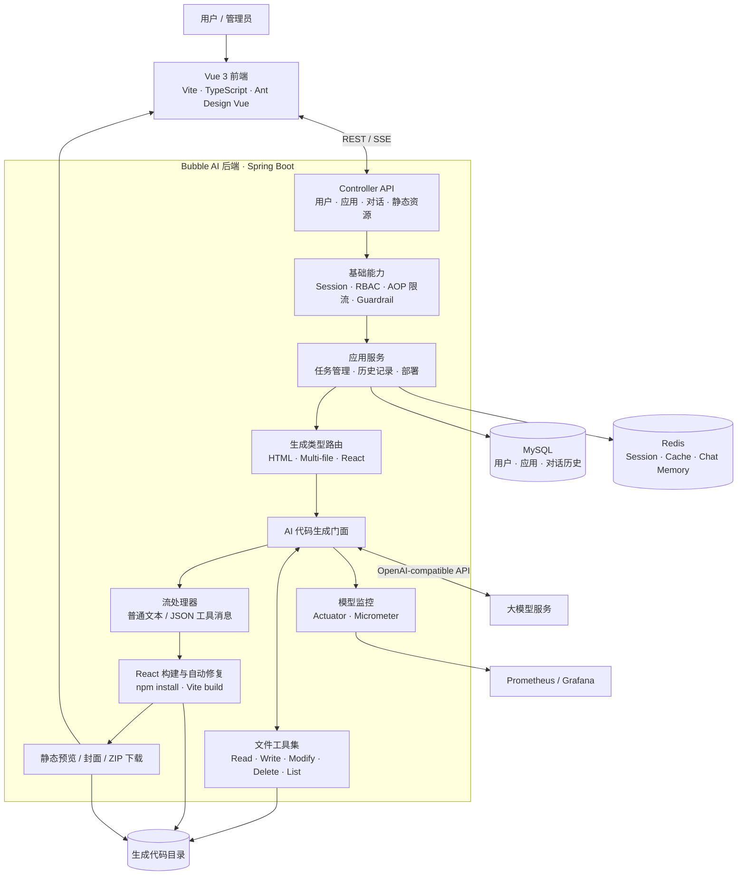
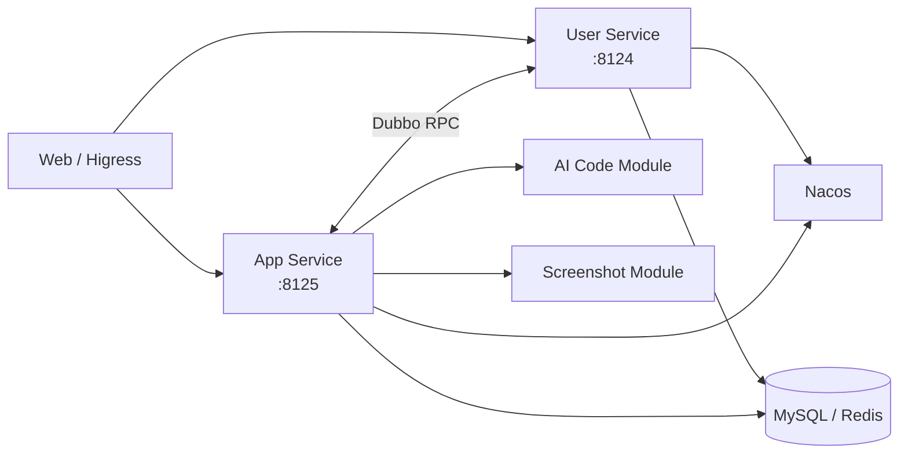
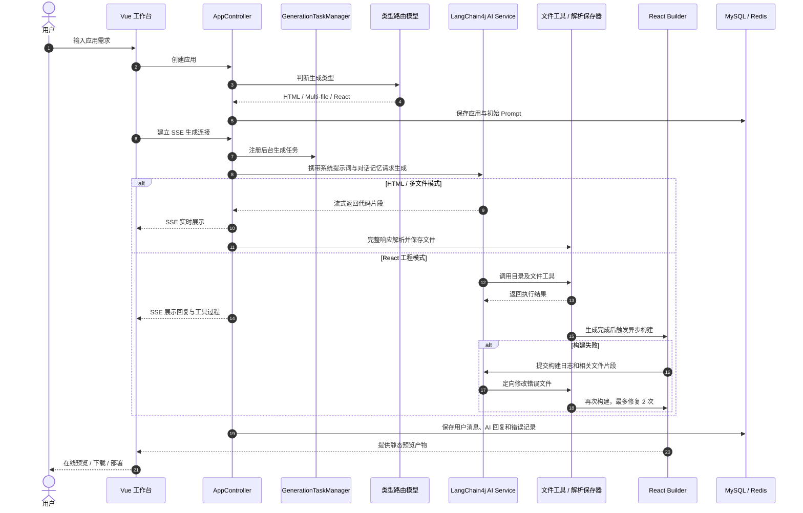

<div align="center">

**简体中文** | [English](README_EN.md)


# Bubble AI

### 一句话生成可运行的 Web 应用

通过自然语言描述需求，自动完成代码生成、文件写入、工程构建、在线预览与部署，让想法快速变成可以访问的网页应用。

`AI Code Generation` · `Vue 3` · `Spring Boot` · `LangChain4j` · `SSE` · `Redis` · `MySQL`

</div>

---

## 项目简介

Bubble AI 是一个面向 Web 应用创作场景的 AI 应用生成平台。用户只需输入一句需求，系统便会智能判断合适的生成模式，并通过大模型生成单页 HTML、多文件原生项目或 React 工程。

项目不仅负责“输出代码”，还打通了从需求理解到结果交付的完整链路：

- 自然语言创建应用，支持连续对话迭代
- 智能路由 HTML、多文件、React 三种生成模式
- 基于 SSE 实时展示模型输出及工具执行过程
- 通过文件工具完成 React 工程的读取、写入、修改和删除
- 自动执行依赖安装与生产构建，失败后触发有限次数的 AI 修复
- 在线预览、可视化选取页面元素、代码下载与应用部署
- MySQL 持久化业务数据，Redis 保存 Session、缓存及对话记忆
- 请求限流、输入安全护栏、权限校验与统一异常处理
- 采集模型调用指标，并支持 Prometheus + Grafana 可观测性
- 提供单体实现及面向部署演进的微服务版本

## 功能展示

| 功能 | 说明 |
| --- | --- |
| AI 创建应用 | 输入产品描述后创建应用，并自动进入生成工作台 |
| 三种生成模式 | 原生 HTML、原生多文件、React + Vite 工程 |
| 实时生成 | SSE 推送文本、代码片段、工具选择和工具执行结果 |
| 连续编辑 | 基于应用维度维护上下文，通过后续对话持续修改项目 |
| 可视化编辑 | 在同源预览页中点选元素，将元素信息带入下一轮修改 |
| 工程构建与修复 | React 项目自动执行 `npm install`、`npm run build`，失败后调用 AI 定向修复 |
| 在线预览 | 直接加载生成目录；React 项目预览构建后的 `dist` 产物 |
| 应用交付 | 支持打包下载源码、生成部署标识并发布静态产物 |
| 用户与后台 | 登录注册、作品管理、精选应用、用户/应用/对话后台管理 |
| 任务恢复 | 页面刷新后可重新订阅仍在后台执行的生成任务 |

## 系统架构



### 微服务演进架构

仓库根目录是当前完整的单体实现；`bubble-ai-microservice` 目录提供了按领域拆分的演进版本，包括用户服务、应用与 AI 服务、截图服务、公共模块、模型模块和内部调用客户端。部署方案通过 Nacos 完成服务注册与发现，通过 Dubbo 完成内部 RPC 调用，并可由 Higress 统一承接公网流量。



## 核心工作流程



### 流程拆解

1. **创建与智能路由**：前端提交初始描述，后端调用轻量路由模型，将需求映射为 `html`、`multi_file` 或 `react_project`，随后持久化应用信息。
2. **建立生成任务**：浏览器通过 SSE 发起生成请求。`GenerationTaskManager` 使用 Reactor Sink 保存正在运行的任务，使生成过程不依赖单个浏览器连接；刷新页面后可重新订阅。
3. **加载上下文**：AI Service 以 `appId` 作为记忆标识，从数据库加载最近的聊天记录，并使用 Redis Chat Memory 维持连续对话。
4. **执行生成**：HTML 与多文件模式直接接收代码流；React 模式允许模型自主调用文件工具，逐步建立完整工程。
5. **处理流消息**：普通模式使用文本处理器；React 模式解析 AI 回复、工具请求、工具结果三类 JSON 消息，转换为用户可读内容后继续通过 SSE 推送。
6. **保存与构建**：普通模式在流完成后统一解析、落盘；React 模式由工具实时修改文件，并在结束后异步执行依赖安装和 Vite 构建。
7. **自动修复**：构建失败时提取错误日志、关联文件和 import 关系，再让模型针对现有项目修复，避免无边界重写。
8. **预览与交付**：构建成功后生成应用封面，前端加载静态资源进行预览，并支持源码 ZIP 下载和静态部署。

## 技术栈

### 前端

| 技术 | 项目中的作用 |
| --- | --- |
| Vue 3 + Composition API | 构建首页、AI 工作台、应用编辑页和管理后台 |
| TypeScript | 约束接口、应用数据、流消息及组件状态 |
| Vite | 前端开发服务器与生产构建 |
| Ant Design Vue | 表单、按钮、弹窗、分页、消息反馈等 UI 基础组件 |
| Pinia | 保存登录用户等跨页面状态 |
| Vue Router | 用户、应用工作台和管理端路由及访问控制 |
| Axios | 常规 REST API 请求与统一响应处理 |
| EventSource / SSE | 接收代码生成流，区分数据、业务错误和完成事件 |
| highlight.js | 实时高亮 AI 返回的代码块 |
| iframe Bridge | 在同源预览中定位页面元素，辅助可视化修改 |

### 后端与 AI

| 技术 | 项目中的作用 |
| --- | --- |
| Java 21 | 使用虚拟线程执行构建输出读取、异步修复等任务 |
| Spring Boot 3 | 提供 Web API、配置管理、依赖注入、Session 与监控端点 |
| Project Reactor | 使用 `Flux`、`Sinks` 组织流式生成和断线重连 |
| LangChain4j | 声明式 AI Service、Prompt 模板、Chat Memory、工具调用与模型监听 |
| OpenAI-compatible API | 通过可配置的 Base URL 接入支持兼容协议的模型供应商 |
| Prompt Routing | 独立路由模型根据需求复杂度选择生成模式，平衡速度、成本和工程能力 |
| Tool Calling | 为 React 模式注册文件读取、目录读取、写入、修改和删除工具 |
| Guardrail | 生成前检查输入安全，预留输出重试与校验机制 |
| Facade + Strategy + Template | 统一生成入口，并按代码类型选择解析器、保存器和流处理器 |
| Caffeine | 按应用与生成类型缓存 AI Service 实例，限制容量与生存时间 |

### 数据、工程与基础设施

| 技术 | 项目中的作用 |
| --- | --- |
| MySQL | 持久化用户、应用元数据和聊天历史 |
| MyBatis-Flex | CRUD、条件查询、分页和代码生成 |
| Redis | Spring Session、业务缓存和 LangChain4j 对话记忆 |
| Redisson | 分布式限流的 Redis 客户端基础设施 |
| Caffeine + Spring Cache | 缓存热门精选应用和 AI Service，降低重复查询与初始化开销 |
| Playwright | 对生成页面截图，产出应用封面 |
| npm + Vite Build | 校验并构建模型生成的 React 项目 |
| Actuator + Micrometer | 暴露健康检查及 Prometheus 指标 |
| Prometheus + Grafana | 观察模型请求、Token、耗时和异常；仓库内提供 Dashboard JSON |
| Knife4j / OpenAPI | 在线接口文档与调试 |
| Nacos + Dubbo | 微服务版本中的注册发现与内部服务调用 |
| Docker Compose | 编排微服务、MySQL、Redis 和 Nacos |

## 核心设计说明

### 1. 生成模式路由

系统没有将所有需求都交给同一种生成链路，而是先通过 `AiCodeGenTypeRoutingService` 判断复杂度：

- **HTML**：适合活动页、介绍页等单文件场景，生成快、预览成本低。
- **Multi-file**：将 HTML、CSS、JavaScript 分离，适合结构清晰的原生网站。
- **React Project**：适合组件化、复杂交互和多页面应用，支持工具调用、构建和自动修复。

这种设计让简单任务保持轻量，也为复杂项目保留完整工程能力。

### 2. SSE 与可恢复生成任务

后端将模型输出包装为标准 SSE：普通数据使用 `data`，业务异常使用 `business-error`，结束时发送 `done`。生成任务由服务端主动订阅并存入内存任务表，即使浏览器关闭连接，任务仍可继续运行；页面恢复后通过状态接口和监听接口重新接收已有内容。

当前任务管理是**单实例内存实现**。如果横向扩容，建议将任务状态、事件日志和订阅协调迁移至 Redis Streams、消息队列或专门的任务服务。

### 3. Agent 工具调用

React 工程不是一次性要求模型返回全部代码，而是向模型开放受控的项目文件工具。模型可以读取目录、读取文件、写入文件、精确修改和删除文件。工具统一限制在应用对应的生成目录内，并将执行过程转换为前端可读消息。

相比拼接一个超长代码块，这种方式更适合多轮修改，也能减少重复输出整个工程的 Token 消耗。

### 4. 构建与 AI 自动修复

代码生成完成后，`ReactProjectBuilder` 会检查 Vite 入口，执行依赖安装与生产构建，并返回命令、退出码、输出和错误摘要。构建失败时，修复服务从日志中识别相关文件，补充 import 依赖信息，再调用专用修复 Prompt。

修复过程最多执行 2 次，并设置超时和日志长度上限，避免任务无限循环或将过多无关内容送入模型。

### 5. 对话记忆与历史记录

MySQL 中的聊天历史是可查询的业务事实，Redis Chat Memory 是面向模型推理的短期上下文。AI Service Factory 按 `appId + codeGenType` 创建并缓存服务实例：普通模式保留较小消息窗口，React 工具模式保留更长上下文，从而兼顾成本和复杂任务连续性。

### 6. 安全与稳定性

- Session 默认空闲超时为 2 小时，Cookie 为浏览器会话 Cookie；HTTPS 默认启用 `Secure`
- 单体 Session 使用 `bubble-ai:monolith:session` 命名空间，微服务共享 `bubble-ai:microservice:session`
- `SESSION_CREATION_LOG_ENABLED=true` 会临时记录 Session 创建请求，定位完成后应设为 `false`
- Knife4j 4.4.0 默认禁用：其 BasicAuth Filter 会在所有请求上创建 Session；生产文档入口应由网关鉴权
- 本地需要接口文档时，显式设置 `KNIFE4J_ENABLE=true`、`SPRINGDOC_API_DOCS_ENABLED=true` 和 `SPRINGDOC_SWAGGER_UI_ENABLED=true`
- 用户只能生成、部署和下载自己的应用，管理员接口通过注解鉴权
- 基于 Redisson 与 AOP 的用户级 AI 请求限流
- 输入 Guardrail 在调用模型前进行 Prompt 安全检查
- SSE 将内部异常转换为稳定的业务错误结构
- 生成目录定时清理，减少临时文件长期占用磁盘
- 热门列表缓存仅覆盖有限页数，并在应用变更后主动失效

#### Session 诊断与历史清理

发布后先确认日志中只有成功登录请求出现 `SESSION_CREATION_CALL` / `SESSION_CREATED`，再设置
`SESSION_CREATION_LOG_ENABLED=false` 关闭临时调用栈。所有旧实例停止后，可以先统计旧默认命名空间：

```bash
redis-cli --scan --pattern 'spring:session:*' | wc -l
```

确认新会话已经写入 `bubble-ai:monolith:session:*` 后，再分批异步删除旧键：

```bash
redis-cli --scan --pattern 'spring:session:*' | xargs -r -n 200 redis-cli UNLINK
```

远程 Redis 应通过 `REDISCLI_AUTH` 或密钥管理注入认证信息。不要使用 `FLUSHDB`，因为同一数据库还包含业务缓存、限流和对话记忆。

## 项目结构

```text
bubble-ai/
├── bubble-ai-frontend/            # Vue 3 + TypeScript 前端
│   ├── src/pages/                 # 首页、工作台、用户页、管理后台
│   ├── src/components/            # 应用卡片、布局、页头页尾等组件
│   └── src/api/                   # OpenAPI 生成的接口客户端
├── src/main/java/com/bubble/...   # Spring Boot 单体后端
│   ├── ai/                        # AI Service、路由、工具、护栏和消息模型
│   ├── core/                      # 门面、解析保存、流处理、构建修复
│   ├── controller/                # 用户、应用、聊天历史、静态资源接口
│   ├── service/                   # 核心业务服务
│   ├── ratelimiter/               # 分布式限流注解与切面
│   └── monitor/                   # 模型指标采集
├── src/main/resources/
│   ├── prompt/                    # 路由、生成和修复系统 Prompt
│   └── mapper/                    # MyBatis-Flex XML
├── bubble-ai-microservice/        # Nacos + Dubbo 微服务演进版本
├── docs/grafana/                  # Grafana 模型监控面板
└── sql/creat_table.sql            # MySQL 初始化脚本
```

## 本地运行

### 环境要求

- JDK 21
- Maven 3.9+（也可使用仓库中的 Maven Wrapper）
- Node.js 22+
- MySQL 8+
- Redis 7+
- 可选：Playwright 浏览器运行环境，用于自动截图
- 一个支持 OpenAI-compatible Chat API 的模型服务

### 1. 初始化数据库

```bash
mysql -u root -p < sql/creat_table.sql
```

默认数据库名为 `bubble_ai_backend`。请根据本地环境修改 `src/main/resources/application.yml` 中的数据库与 Redis 配置。

### 2. 配置模型

项目分别使用普通 Chat 模型、流式模型、推理流式模型和路由模型。根目录单体版本当前从 `src/main/resources/application-local.yml` 读取这些配置，请先将其中的密钥替换为自己的配置；更推荐把字段改为 `${ENV_NAME:}` 形式，再通过环境变量注入：

```bash
export AI_CHAT_API_KEY="your-api-key"
export AI_STREAMING_API_KEY="your-api-key"
export AI_REASONING_API_KEY="your-api-key"
export AI_ROUTING_API_KEY="your-api-key"
```

微服务版本已经支持上述 `AI_*` 环境变量。模型端点、模型名称、最大 Token、温度和超时均可在对应的 `application-*.yml` 中配置。使用其他模型供应商时，需要确保其 API 与 OpenAI Chat Completions 及流式/工具调用能力兼容。

### 3. 启动后端

```bash
./mvnw spring-boot:run
```

默认地址：`http://localhost:8123/api`

启动后可访问：

- Knife4j：`http://localhost:8123/api/doc.html`
- 健康检查：`http://localhost:8123/api/actuator/health`
- Prometheus 指标：`http://localhost:8123/api/actuator/prometheus`

### 4. 启动前端

```bash
cd bubble-ai-frontend
npm install
npm run dev
```

前端默认由 Vite 启动。API 地址与预览地址可通过 `bubble-ai-frontend/src/config/env.ts` 或对应的 Vite 环境配置调整。

### 5. 运行测试

```bash
./mvnw test

cd bubble-ai-frontend
npm run type-check
npm run build
```

## 微服务部署

微服务版本提供 Docker Compose 配置，可启动用户服务、应用服务、MySQL、Redis 和 Nacos：

```bash
cd bubble-ai-microservice
cp deploy/.env.example .env
# 编辑 .env，填入数据库密码、Redis 密码和模型密钥
docker compose --env-file .env -f deploy/docker-compose.yml up -d --build
```

完整说明见 [`bubble-ai-microservice/deploy/README.md`](bubble-ai-microservice/deploy/README.md)。生产环境建议通过 Higress/Nginx 暴露统一入口，不要直接公开 MySQL、Redis、Nacos 和内部服务端口。

## 未来规划

- [ ] **多模型选择接入**：建立统一模型适配层和能力注册中心，允许用户按质量、速度、成本选择模型，并支持故障降级与智能路由。
- [ ] **应用多版本管理**：为每次生成和修改保存不可变版本、Prompt、模型及构建信息，支持一键回滚。
- [ ] **在线差异对比**：提供代码 Diff、页面截图对比和双版本并排预览，直观展示每轮修改带来的变化。
- [ ] **图像与文本识别**：支持上传截图、设计稿和需求文档，通过多模态模型完成 OCR、布局理解、视觉还原及图文联合生成。
- [ ] **接入 MongoDB**：在保留 MySQL 核心关系数据的基础上，用 MongoDB 承载版本快照、模型原始响应、识别结果和动态业务文档，让项目具备更完整的真实业务处理能力。
- [ ] **生产级任务调度**：将本地生成任务升级为分布式队列，支持重试、取消、进度查询、并发配额和多实例消费。
- [ ] **生成沙箱强化**：隔离模型生成项目的依赖安装与构建过程，增加资源配额、依赖白名单和恶意代码检测。
- [ ] **质量评测体系**：围绕构建成功率、首屏质量、需求覆盖度、Token 成本和响应耗时建立自动化评测集。

## 安全说明

请勿在 `application-*.yml`、`.env` 或前端代码中提交真实数据库密码和模型 API Key。若历史提交中曾出现明文密钥，请立即在供应商控制台**撤销并轮换**，仅从环境变量或密钥管理服务注入新密钥。

模型生成的项目会执行依赖安装与构建命令。将服务开放给不受信任用户前，应把构建任务放入容器或沙箱，并限制网络、CPU、内存、执行时间和文件系统权限。

## 参与贡献

欢迎通过 Issue 提交问题、功能建议或技术方案，也欢迎通过 Pull Request 完善生成链路、模型适配、工程构建和用户体验。

1. Fork 本仓库
2. 创建功能分支：`git checkout -b feat/your-feature`
3. 提交变更：`git commit -m "feat: add your feature"`
4. 推送分支并发起 Pull Request

---

<div align="center">

如果这个项目对你有帮助，欢迎点亮 Star ⭐

</div>
