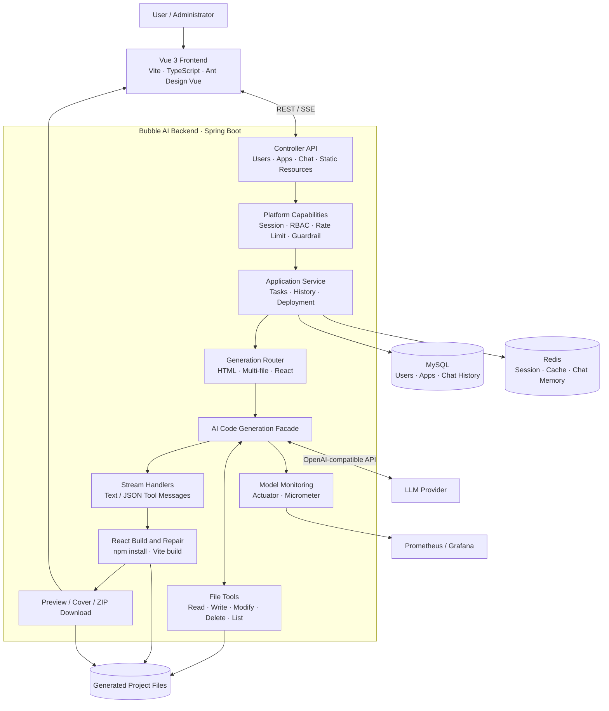
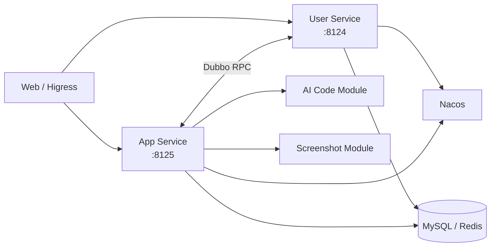
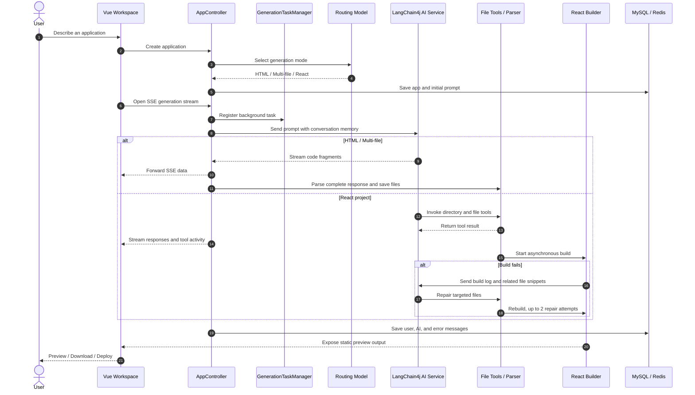

<div align="center">

[简体中文](README.md) | **English**


# Bubble AI

### Turn one sentence into a runnable web application

Describe what you want in natural language. Bubble AI generates the code, writes project files, builds the application, and makes it available for preview and deployment.

`AI Code Generation` · `Vue 3` · `Spring Boot` · `LangChain4j` · `SSE` · `Redis` · `MySQL`

</div>

---

## Overview

Bubble AI is an AI-powered platform for creating web applications. A user describes an idea, the system selects an appropriate generation mode, and an LLM produces either a single HTML page, a native multi-file website, or a complete React project.

The project covers the entire workflow from idea to delivery instead of merely returning a block of code:

- Create applications with natural language and refine them through follow-up conversations
- Route requests to HTML, multi-file, or React generation automatically
- Stream model output and tool activity to the browser with SSE
- Read, write, modify, delete, and inspect files in generated React projects
- Install dependencies and run production builds automatically
- Trigger bounded AI repair attempts when a React build fails
- Preview generated applications, select visual elements, download source code, and deploy static builds
- Store business data in MySQL and sessions, caches, and chat memory in Redis
- Enforce rate limits, prompt safety checks, authorization, and consistent error handling
- Export model metrics to Prometheus and provide a Grafana dashboard
- Include both a monolithic implementation and an evolving microservice version

## Features

| Feature | Description |
| --- | --- |
| AI application creation | Create a project from a product description and enter the generation workspace automatically |
| Three generation modes | Single-file HTML, native multi-file, and React + Vite projects |
| Real-time generation | Stream text, code fragments, tool requests, and tool results over SSE |
| Iterative editing | Maintain application-specific context and refine a project through conversation |
| Visual editing | Select an element inside a same-origin preview and include its details in the next request |
| Build and repair | Run `npm install` and `npm run build`, then ask AI to repair targeted files when a build fails |
| Live preview | Serve native output directly and React applications from their generated `dist` directory |
| Delivery | Download source as a ZIP archive or publish static output with a deployment key |
| User and admin features | Authentication, personal projects, featured applications, and management pages |
| Stream recovery | Reconnect to a server-side generation task after refreshing the page |

## Architecture



### Microservice evolution

The repository root contains the complete monolithic implementation. The `bubble-ai-microservice` directory is an evolving domain-oriented version with user, application and AI, screenshot, shared, model, and internal-client modules. It uses Nacos for service registration and discovery, Dubbo for internal RPC, and can sit behind a unified Higress gateway.



## Core Workflow



### Workflow details

1. **Creation and routing** — The backend sends the initial description to a lightweight routing model, maps the result to `html`, `multi_file`, or `react_project`, and persists the application.
2. **Generation task** — The browser starts an SSE request. `GenerationTaskManager` stores an actively subscribed Reactor stream, allowing generation to continue independently of one browser connection.
3. **Context loading** — The AI service uses `appId` as its memory identifier, loads recent history from MySQL, and keeps the active model context in Redis Chat Memory.
4. **Code generation** — HTML and multi-file modes return a direct code stream. React mode lets the model assemble and update a project with controlled file tools.
5. **Stream processing** — Text modes use a plain stream handler. React mode parses AI responses, tool requests, and tool results from typed JSON messages before sending readable content to the UI.
6. **Persistence and build** — Native output is parsed and saved after the stream completes. React files are changed by tools and built asynchronously with npm and Vite.
7. **Automatic repair** — A failed build is reduced to relevant logs, files, and import relationships. A dedicated repair prompt asks the model to modify only the affected project files.
8. **Preview and delivery** — After a successful build, Bubble AI generates a cover, serves the static application, and allows source download or deployment.

## Technology Stack

### Frontend

| Technology | Purpose |
| --- | --- |
| Vue 3 + Composition API | Home page, AI workspace, application editing, and admin pages |
| TypeScript | Type-safe APIs, application models, stream messages, and UI state |
| Vite | Development server and production build |
| Ant Design Vue | Forms, tables, pagination, dialogs, buttons, and feedback |
| Pinia | Shared state such as the authenticated user |
| Vue Router | User, workspace, and admin routes with access checks |
| Axios | Standard REST requests and shared response handling |
| EventSource / SSE | Streaming data, business errors, and completion events |
| highlight.js | Syntax highlighting for streamed code blocks |
| iframe bridge | Selecting elements inside a same-origin preview for visual editing |

### Backend and AI

| Technology | Purpose |
| --- | --- |
| Java 21 | Backend runtime, including virtual threads for build output and repair tasks |
| Spring Boot 3 | Web APIs, configuration, dependency injection, sessions, and actuator endpoints |
| Project Reactor | `Flux` and `Sinks` for streamed generation and reconnection |
| LangChain4j | Declarative AI services, prompt templates, chat memory, tools, and model listeners |
| OpenAI-compatible APIs | Configurable access to providers implementing compatible chat endpoints |
| Prompt routing | Select a generation mode based on request complexity, latency, and engineering needs |
| Tool calling | Register safe file read, list, write, modify, and delete operations for React mode |
| Guardrails | Validate prompts before generation and provide extension points for output validation |
| Facade, Strategy, Template | Route code types to dedicated parsers, savers, and stream handlers |
| Caffeine | Cache AI service instances per application and generation mode |

### Data and Infrastructure

| Technology | Purpose |
| --- | --- |
| MySQL | Users, application metadata, and chat history |
| MyBatis-Flex | CRUD, filtering, pagination, and code generation |
| Redis | Spring Session, application cache, and LangChain4j chat memory |
| Redisson | Redis infrastructure for distributed rate limiting |
| Caffeine + Spring Cache | Local AI service caching and featured-application caching |
| Playwright | Capture generated pages and create application covers |
| npm + Vite Build | Validate and produce deployable React output |
| Actuator + Micrometer | Health and Prometheus metrics endpoints |
| Prometheus + Grafana | Model requests, tokens, latency, and error monitoring |
| Knife4j / OpenAPI | Interactive API documentation |
| Nacos + Dubbo | Registration, discovery, and RPC in the microservice version |
| Docker Compose | Orchestrate services, MySQL, Redis, and Nacos |

## Key Design Decisions

### Generation-mode routing

Bubble AI does not force every request through the same expensive workflow:

- **HTML** is fast and lightweight for landing pages and simple sites.
- **Multi-file** separates HTML, CSS, and JavaScript for structured native projects.
- **React Project** supports components, complex interactions, tool calls, builds, and automatic repair.

### Recoverable SSE generation

The backend emits standard SSE data, `business-error` events, and a final `done` event. Generation is subscribed to on the server and stored in an in-memory task map, so it can continue when the browser disconnects. The UI can query task status and reconnect after a refresh.

The current task manager is local to one application instance. A horizontally scaled deployment should move task state and event replay to Redis Streams, a message broker, or a dedicated task service.

### Agent file tools

React projects are assembled through controlled file operations instead of one oversized response. The model can inspect directories and files, write new files, apply precise modifications, and delete files. Each tool is scoped to the generated directory for the current application.

### Build and AI repair

`ReactProjectBuilder` validates the Vite entry point, installs dependencies, runs the production build, and captures the command, exit code, output, and error summary. If the build fails, the repair service extracts related files and imports and starts a dedicated repair flow. Repair is limited to two attempts and protected by time and log-size limits.

### Conversation history and memory

MySQL chat history is the durable business record. Redis Chat Memory is the short-term context presented to the model. AI service instances are cached using `appId + codeGenType`; React tool mode keeps a larger message window than the simpler generation modes.

### Safety and stability

- Configurable Session Cookie behavior for HTTP and HTTPS deployments
- Ownership checks for generation, deployment, and source downloads
- Annotation-based administrator authorization
- User-level distributed rate limiting for AI requests
- Prompt input guardrails and stable SSE business errors
- Scheduled cleanup of generated files
- Bounded caching with explicit invalidation

## Repository Structure

```text
bubble-ai/
├── bubble-ai-frontend/            # Vue 3 + TypeScript frontend
│   ├── src/pages/                 # Home, workspace, user, and admin pages
│   ├── src/components/            # Shared UI components
│   └── src/api/                   # OpenAPI-generated client
├── src/main/java/com/bubble/...   # Spring Boot monolith
│   ├── ai/                        # Services, routing, tools, guardrails, messages
│   ├── core/                      # Facade, parsing, saving, streams, build repair
│   ├── controller/                # User, app, history, and static APIs
│   ├── service/                   # Business services
│   ├── ratelimiter/               # Distributed rate-limit aspect
│   └── monitor/                   # Model metrics
├── src/main/resources/
│   ├── prompt/                    # Routing, generation, and repair prompts
│   └── mapper/                    # MyBatis-Flex XML
├── bubble-ai-microservice/        # Nacos + Dubbo evolution
├── docs/grafana/                  # Grafana model dashboard
└── sql/creat_table.sql            # MySQL schema
```

## Local Development

### Requirements

- JDK 21
- Maven 3.9+ or the included Maven Wrapper
- Node.js 22+
- MySQL 8+
- Redis 7+
- Optional Playwright browser runtime for screenshots
- An LLM endpoint compatible with the OpenAI Chat API

### 1. Initialize MySQL

```bash
mysql -u root -p < sql/creat_table.sql
```

The default database is `bubble_ai_backend`. Update the database and Redis settings in `src/main/resources/application.yml` for your environment.

### 2. Configure models

The monolith currently reads model settings from `src/main/resources/application-local.yml`. Replace the local values with your own settings. Prefer changing secret fields to `${ENV_NAME:}` expressions and injecting credentials through environment variables:

```bash
export AI_CHAT_API_KEY="your-api-key"
export AI_STREAMING_API_KEY="your-api-key"
export AI_REASONING_API_KEY="your-api-key"
export AI_ROUTING_API_KEY="your-api-key"
```

The microservice version already supports these `AI_*` variables. Endpoints, model names, token limits, temperature, and timeouts can be configured in the relevant `application-*.yml` files. Alternative providers must support the required OpenAI-compatible streaming and tool-calling features.

### 3. Start the backend

```bash
./mvnw spring-boot:run
```

The default API base URL is `http://localhost:8123/api`.

- Knife4j: `http://localhost:8123/api/doc.html`
- Health: `http://localhost:8123/api/actuator/health`
- Prometheus: `http://localhost:8123/api/actuator/prometheus`

### 4. Start the frontend

```bash
cd bubble-ai-frontend
npm install
npm run dev
```

Configure the API and preview URLs through `bubble-ai-frontend/src/config/env.ts` or the appropriate Vite environment settings.

### 5. Run checks

```bash
./mvnw test

cd bubble-ai-frontend
npm run type-check
npm run build
```

## Microservice Deployment

The Docker Compose setup starts the user and application services together with MySQL, Redis, and Nacos:

```bash
cd bubble-ai-microservice
cp deploy/.env.example .env
# Add database, Redis, and model credentials to .env
docker compose --env-file .env -f deploy/docker-compose.yml up -d --build
```

See [`bubble-ai-microservice/deploy/README.md`](bubble-ai-microservice/deploy/README.md) for full deployment instructions. In production, expose one gateway through Higress or Nginx and keep MySQL, Redis, Nacos, and internal service ports private.

## Roadmap

- [ ] **Multiple model providers** — Add a unified adapter and capability registry, user-selectable models, intelligent routing, and fallback policies.
- [ ] **Application versioning** — Save immutable code, prompt, model, and build metadata for every generation and support one-click rollback.
- [ ] **Online difference comparison** — Add code diffs, screenshot comparisons, and side-by-side previews for any two versions.
- [ ] **Image and text understanding** — Accept screenshots, designs, and requirement documents for OCR, layout analysis, visual reconstruction, and multimodal generation.
- [ ] **MongoDB integration** — Keep core relational data in MySQL while storing version snapshots, raw model responses, recognition results, and flexible business documents in MongoDB.
- [ ] **Production task scheduling** — Add a distributed queue with retry, cancellation, progress reporting, quotas, and multi-instance workers.
- [ ] **Stronger generation sandbox** — Isolate dependency installation and builds with network, CPU, memory, time, and filesystem limits.
- [ ] **Quality evaluation** — Track build success, requirement coverage, visual quality, latency, and token cost with reproducible evaluation datasets.

## Security

Never commit real database passwords or model API keys in `application-*.yml`, `.env`, or frontend code. If a secret has ever appeared in Git history, revoke and rotate it immediately and inject its replacement through environment variables or a secret manager.

Generated projects install dependencies and execute build commands. Before exposing the platform to untrusted users, run these tasks in an isolated container or sandbox with strict network, CPU, memory, execution-time, and filesystem policies.

## Contributing

Issues, feature proposals, and pull requests are welcome.

1. Fork the repository
2. Create a branch: `git checkout -b feat/your-feature`
3. Commit your changes: `git commit -m "feat: add your feature"`
4. Push the branch and open a pull request

---

<div align="center">

If Bubble AI helps you, consider giving the project a Star ⭐

</div>
